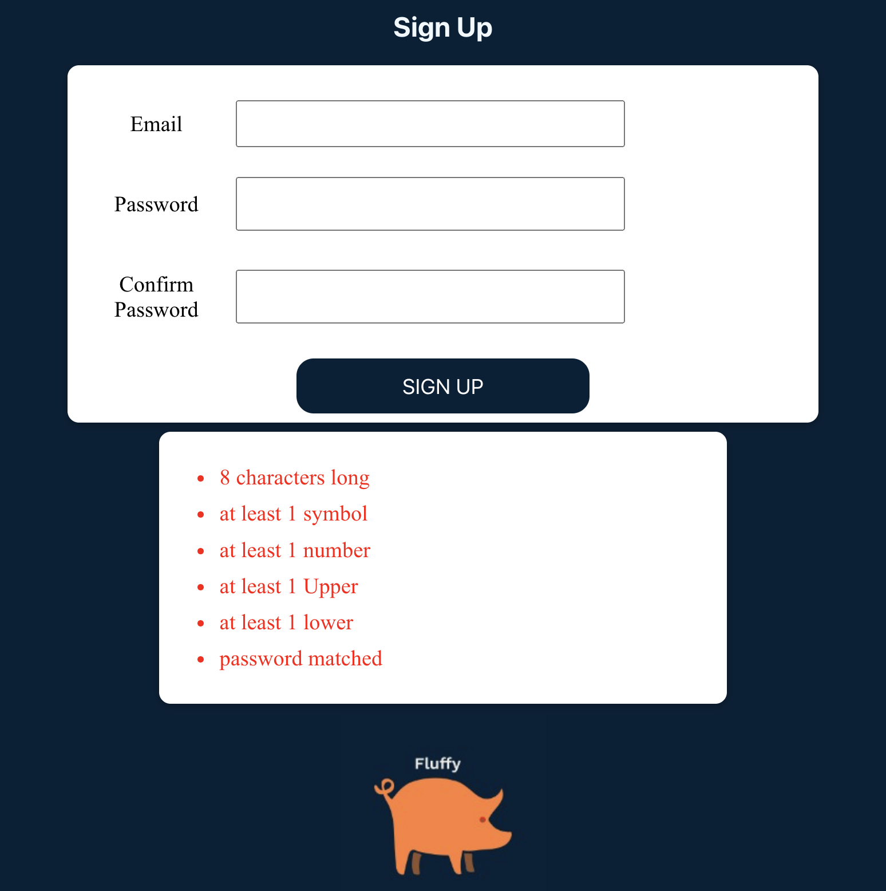
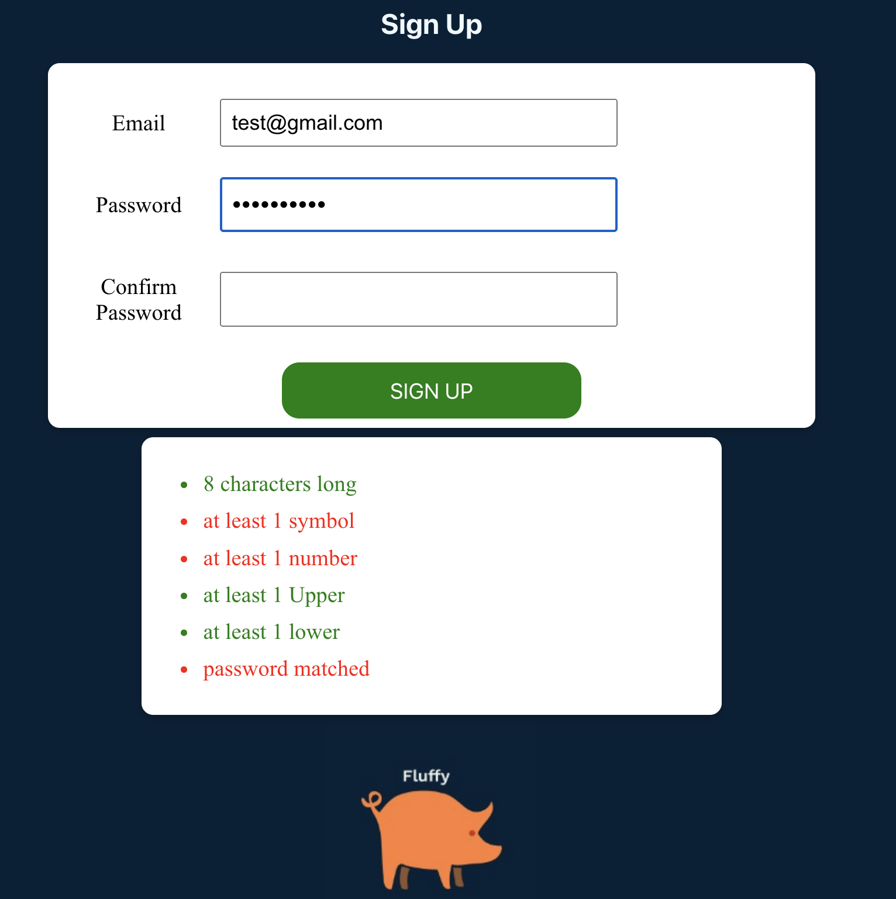

# Signup UI
> React application to create singup ui.

### Features:
- tests the validity of email
- tests the validity of passwords

#### Validity of passwords:
- 8 chars long?
- at least 1 symbol?
- at least 1 number?
- at least 1 upper?
- at least 1 lower?
- password matched?

#### Validity of email:
- follows this pattern ----@----.---- ?3

### SignUp

### Password Validity

### Email Validity
